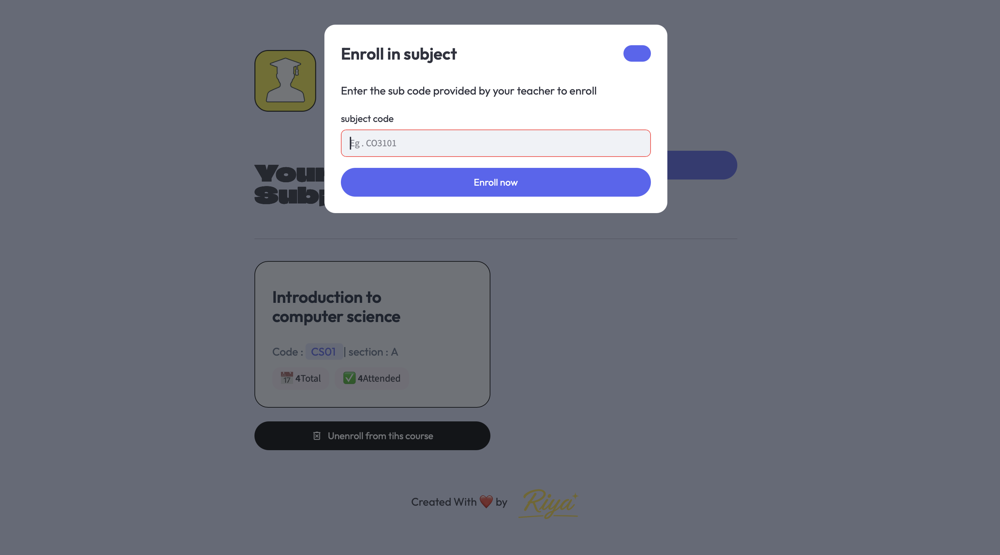
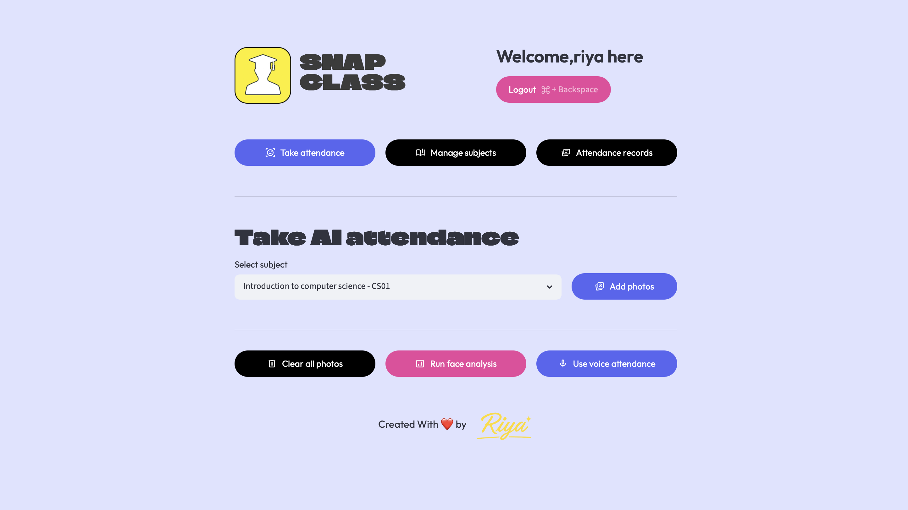

<div align="center">

# 🎓 SnapClass AI

### AI-Powered Smart Attendance System using Face Recognition, Voice Recognition & QR-based Classroom Management

Automatically identify students from classroom photos or classroom audio, manage subjects, generate QR enrollment links, and securely store attendance records using Supabase.

<p align="center">
  <a href="https://snapclasslandingpage.vercel.app">
    
  </a>
</p>


</div>

---

# 📖 Overview

SnapClass AI is an intelligent classroom attendance platform that replaces traditional attendance systems with AI-powered face recognition and voice recognition.

Teachers can create subjects, share QR-based enrollment links, upload classroom images or record classroom audio, and automatically generate attendance records.

Students can securely join classrooms, monitor their attendance, and access enrolled subjects through a clean dashboard.

---

# ✨ Features

## 👨‍🏫 Teacher Portal

- Secure authentication
- Create and manage subjects
- Generate QR code & join links
- Upload classroom images
- Capture photos directly from camera
- AI Face Recognition Attendance
- AI Voice Recognition Attendance
- Attendance history
- Attendance analytics

---

## 👨‍🎓 Student Portal

- Secure login
- Join classes using subject code
- QR-based enrollment
- View enrolled subjects
- View attendance records

---

## 🤖 AI Features

- Face Recognition
- Voice Biometrics
- Automatic Student Identification
- Attendance Verification
- Cloud-based Attendance Storage

---

# 🚀 Live Demo

## 🌐 Landing Page

https://snapclasslandingpage.vercel.app

---

# 🏗️ Project Workflow

```text
Teacher Login
      │
      ▼
Create Subject
      │
      ▼
Generate QR / Subject Code
      │
      ▼
Student Enrolls
      │
      ▼
Teacher Uploads Classroom Photos
      │
      ▼
AI Face Recognition
      │
      ▼
(Optional)
Voice Attendance Verification
      │
      ▼
Attendance Stored in Supabase
      │
      ▼
Student Views Attendance
```

---

# 🏛️ System Architecture

```text
                     SnapClass AI

                   Streamlit Frontend
                          │
          ┌───────────────┴────────────────┐
          │                                │
     Teacher Portal                  Student Portal
          │                                │
          └───────────────┬────────────────┘
                          │
                    Authentication
                          │
                     Supabase Backend
                          │
      ┌───────────────────┼────────────────────┐
      │                   │                    │
 Face Recognition   Voice Recognition    Attendance Records
      │                   │                    │
      └───────────────────┴────────────────────┘
                          │
                  Attendance Dashboard
```

---

# 🛠 Tech Stack

| Category | Technologies |
|----------|--------------|
| Frontend | Streamlit |
| Backend | Python |
| Database | Supabase |
| Face Recognition | Dlib, OpenCV |
| Voice Recognition | Resemblyzer, Librosa |
| Machine Learning | NumPy, Scikit-Learn |
| Data Processing | Pandas |
| Authentication | Supabase Auth |
| Deployment | Streamlit Cloud / Vercel |

---

# 📷 Screenshots

## 🏠 Landing Page

<p align="center">
  
</p>

---

# 📸 Screenshots

## 🏠 Landing Page

<p align="center">
  
</p>

---

## 👨‍🎓 Student Dashboard

<p align="center">
  
</p>

---

## 👨‍🏫 Teacher Dashboard

<p align="center">
  
</p>
---


# 📂 Project Structure

```text
SnapClass-AI
│
├── assets/
│   ├── landing-page.png
│   ├── student-dashboard.png
│   ├── student-enroll.png
│   ├── student-subject.png
│   ├── teacher-login.png
│   ├── teacher-dashboard.png
│   ├── manage-subjects.png
│   ├── create-subject.png
│   ├── share-qr.png
│   ├── upload-photos.png
│   ├── photos-added.png
│   ├── voice-attendance.png
│   └── attendance-records.png
│
├── src/
├── app.py
├── requirements.txt
├── README.md
└── .gitignore
```

---

# ⚙️ Installation

Clone the repository

```bash
git clone https://github.com/riyakandwal/Snapclass-AI.git
```

Move into the project

```bash
cd Snapclass-AI
```

Create virtual environment

```bash
python -m venv venv
```

Activate virtual environment

### Windows

```bash
venv\Scripts\activate
```

### macOS/Linux

```bash
source venv/bin/activate
```

Install dependencies

```bash
pip install -r requirements.txt
```

Run the application

```bash
streamlit run app.py
```

---

# 🎯 Why SnapClass AI?

Traditional attendance systems suffer from:

- Manual attendance
- Proxy attendance
- Time-consuming process
- Paper records
- Human errors

SnapClass AI solves these problems using artificial intelligence.

✅ Face Recognition

✅ Voice Biometrics

✅ QR Enrollment

✅ Cloud Storage

✅ Modern Dashboard

✅ Fast Attendance

---

# 🚀 Future Improvements

- Mobile Application
- Anti-spoofing Detection
- Real-time Analytics
- Multi-classroom Support
- Email Notifications
- PDF Attendance Reports
- Excel Export
- Attendance Heatmaps
- Liveness Detection

---

# 🤝 Contributing

Contributions are welcome.

1. Fork the repository

2. Create a new branch

```bash
git checkout -b feature-name
```

3. Commit your changes

```bash
git commit -m "Added new feature"
```

4. Push the branch

```bash
git push origin feature-name
```

5. Open a Pull Request

---

# 📄 License

This project is licensed under the MIT License.

---

# 👩‍💻 Author

### Riya

GitHub

https://github.com/riyakandwal

---

<div align="center">

### ⭐ If you like this project, consider giving it a star!

Made with ❤️ using Python, Streamlit and AI.

</div>
